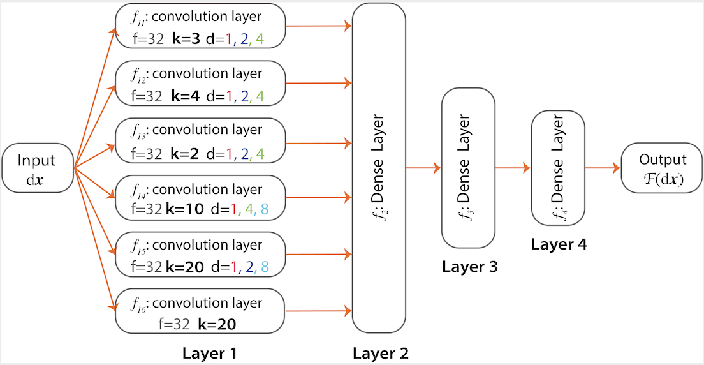

# MoNet for Sparse Experimental Track Data
The code in this repo is based off of the paper here: ([https://doi.org/10.1073/pnas.2017616118](https://doi.org/10.1073/pnas.2017616118)), which introduces MoNet as an architecture for classifying the motion of nanoparticles near surfaces.

* * * * * *
### MoNet Description
MoNet is a trainable convolutional neural network that classifies the behavior of a trajectory from single particle tracking experiments based on three classes of diffusion (Brownian, subdiffusive Fractional Brownian Motion (FBM), and subdiffusive continuous time random walk (CTRW)) and extracts the α exponent for FBM as well as CTRW classes. This is the code for the paper [Anomalous nanoparticle surface diffusion in LCTEM is revealed by deep learning-assisted analysis](https://doi.org/10.1073/pnas.2017616118). The architecture of MoNet is adapted from [Granik et al.](https://github.com/AnomDiffDB/DB) and is modified based on the [p-variation method](https://journals.aps.org/prl/abstract/10.1103/PhysRevLett.103.180602) to capture multiresolution correlations along the trajectory. 

In this repo we improved accuracy of MoNet by simply adding more fully connected layers (suggesting that the model can learn more parameters without overfitting), adjusting the size of the convolutional filters, and utilizing average pooling instead of max pooling to more effectively capture short range dependencies in the particles motion, which are more significant for classification at lower track lengths.

### MoNet Architecture (Original Paper)

 

The architecture of MoNet comprises of 4 layers where the first layer consists of 6 convolutional sublayers (f11, f12, f13, f14, f15, f16) that are applied on the input data in parallel. The first 5 convolutuonal sublayers are three layers deep with relu activation units (relu(·) = max(·,0) for rectification of the feature map), batch normalization (normalizing the responses across features map), and max pooling (finding the maximum over a local neighborhood). The number of filters applied in all of these sublayers are set to 32. After training, each of these filters capture a certain distinct pattern along the trajectory (e.g., descending, ascending patterns). The diversity among the filters are typically ensured via random initialization of the filters and regularization techniques such as batch normalization and drop out. The filter sizes are k = 3, 4, 2, 10, and 20 respectively for the five convolutional sublayers to capture the local dynamics of trajectories in several spacial resolutions. The convolutional sublayers also differ in their dilation factor (i.e., the number of steps that filters skip). Following p-variation we chose dilation factors that span the trajectory via steps of size 2n. The last convolutional sublayer, f16 augments the model using large filter sizes of length 20 without any dilation. The output of the convolutional sublayers are fed into two fully connected layers of size 512 and 128 (f2 and f3, respectively). The final layer of MoNet (f4) is set based on the prediction task. For the anomalous classification task, the last layer is a dense layer of size 3 (corresponding to the three classes of diffusion) with a Softmax activation. For the regression task of finding the α exponent, a dense layer of size 1 with a Sigmoid activation is used in the last layer to capture the output.

### Installation

- install [anaconda](https://docs.anaconda.com/anaconda/install/)
- conda env create -f MoNet.yml
- conda activate MoNet
- conda install -c anaconda keras
- `pip install matplotlib`
- `pip install stochastic`
- `pip install seaborn`

### MoNet Training

For the task of classification, the network is trained on 10,000 simulated trajectories from three classes of diffusion (FBM, Brownian, and CTRW) with randomly chosen parameters. For the task of α extraction the network is trained on 3,000 simulated trajectories (from FBM or CTRW, depending on the code used). We used the same architecture universally regardless of the task (regression/classification). In the example used here the trajectories are 300 frames long; however, the code can be changed to work for any other trajectory length N. A new model needs to be trained for any new trajectory length, which requires changing the testing file as well. 

### Testing using MoNet

For testing data from experiments, MoNet received data in `.mat` format via `classification_on_file(file = './data/AuNRs_300.mat')`. The input data must have the structure of `[x,y,k]`, where k is the index for the trajectory that starts from 1 and goes up to the total number of trajectories that needs to be tested. The example data set included in the ./data folder (`AuNRs_300.mat`) includes all the 300-frame long trajectories collected from our liquid cell TEM experiments for all nanoparticles, indexed from 1 to 459. Please refer to the manuscript for the details about the data collection.

For testing simulated data change the classification testing file to `classification_on_sim()`. 
